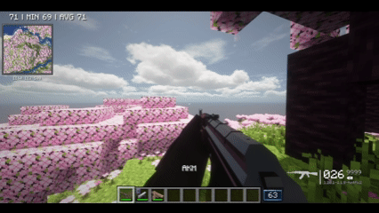
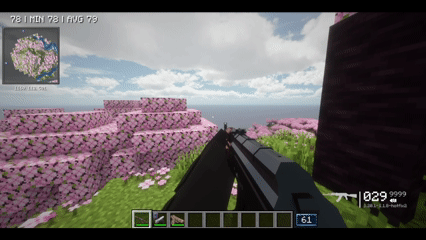

# TaCZ Ad Astra Arm Fix (Unofficial Patch)

With an Ad Astra space suit, netherite space suit or jet suit chestplate on, your first-person arms go wrong while holding a TaCZ gun. They stretch, point off into the distance and get worse as you aim, reload and run. This small companion mod draws your normal arms in first person instead, exactly as without a suit, so TaCZ guns are held properly.

The stretching happens when [playerAnimator](https://www.curseforge.com/minecraft/mc-mods/playeranimator) is installed, which TaCZ uses for its third-person animations. Without it, the suit arm is only slightly out of place, and the mod fixes that too.

| Requirement | Version |
|---|---|
| Ad Astra | 1.15.21 or newer |
| TaCZ | 1.1.8-hotfix2 (tested) |
| Sides | Client only |

| Without the mod | With the mod |
|---|---|
|  |  |

Both clips play at double speed to keep the GIFs short.

## Reason For Existing

Temporarily exists until if/when Ad Astra fixes the issue.

### Credit

This is an unofficial patch, not affiliated with Ad Astra or TaCZ. [Ad Astra](https://github.com/terrarium-earth/Ad-Astra) is made by Terrarium (Alex Nijjar and contributors). [TaCZ (Timeless and Classics Zero)](https://github.com/MCModderAnchor/TACZ) is made by the TaCZ team.

## How It Works

Every first-person arm goes through vanilla's `PlayerRenderer.renderRightHand` or `renderLeftHand`: the empty hand, TaCZ's gun hands and Ad Astra's zip gun. Each fires Forge's `RenderArmEvent`, then calls the private `renderHand`. Ad Astra's `PlayerRendererMixin` cancels `renderHand` whenever the chestplate is a space suit and draws the suit's arm instead.

Cancelling `renderHand` also skips [playerAnimator](https://github.com/KosmX/minecraftPlayerAnimator)'s hook there. That hook marks the model as a first-person render just before `setupAnim`. TaCZ plays its third-person gun animations (holding, aiming, reloading) through playerAnimator, so without that mark they're applied to the first-person arm, bend included. Ad Astra's suit arm also always uses the suit's left arm, even for the right hand.

This mod injects just before the `renderHand` call. When the chestplate is an Ad Astra suit, it draws the arm and sleeve the way vanilla's `renderHand` does, including playerAnimator's first-person step, and skips the call, so Ad Astra's replacement never runs. Forge's event still fires first. With any other chestplate it does nothing.

At startup the log says `Fix applied`, or `Fix not applied` if a later Ad Astra no longer has its `SpaceSuitItem` class. In that case the mod does nothing and Ad Astra draws its suit arm as before. playerAnimator is optional; without it there are no third-person animations to keep off the arm.

## Building

Put these jars in `libs/` (it's gitignored), then run `gradlew build`:

- `ad_astra-forge-1.20.1-1.15.21.jar`
- `botarium-forge-1.20.1-2.3.4.jar`
- `resourcefullib-forge-1.20.1-2.1.29.jar`
- `resourcefulconfig-forge-1.20.1-2.1.3.jar`
- `player-animation-lib-forge-1.0.2-rc1+1.20.jar` (optional at runtime)
- `tacz-1.20.1-1.1.8-hotfix2.jar` (only loaded in the dev client for testing, never compiled against)

## License

MIT. No Ad Astra, TaCZ or playerAnimator code or assets are included, and the icon is original.
